# Elastic Stack: The Basics | TryHackMe WriteUp

Elastic Stack(ELK) is a powerful tool that help collect, store, analyze, search and visualize large size of data. In this room, we'll go through an overview of Elastic Stack functionalities, develop searching, investigation and visualization skills in ELK with practical labs.


## Task 2: Elastic Stack Overview

Elastic Stack (ELK) was originally developed to store, search, and visualize large amounts of data. Organizations used it to monitor application performance and perform searches on large datasets. Over time, its features made it popular in security operations as well. Now, many SOC teams use ELK almost as a SIEM solution. 

Elastic Stack is a collection of different open-source components that work together to collect data from any source, store and search it, and visualize it in real time. 

Elastic Stack contain four key open-source components that works together.


1. Elasticsearch

The first component, Elasticsearch, is a full-text search and analytics engine for JSON-formatted documents. It stores, analyzes, and correlates data and supports a RESTful API for interacting with it.

2. Logstash

Logstash is a data processing engine that takes data from different sources, filters it, or normalizes it, and then sends it to the destination, which could be Kibana or a listening port. A Logstash configuration file is divided into three parts, as shown below.
   - The Input part is where the user defines the source from which the data is being ingested.
   - The Filter part is where the user specifies the filter options to normalize the log ingested above. 
   - The Output part is where the user wants the filtered data to be sent. It can be a listening port, Kibana Interface, Elasticsearch database, or file.

3. Beats

Beats are host-based agents known as data-shippers that ship/transfer data from the endpoints to Elasticsearch. Each beat is a single-purpose agent that sends specific data to Elasticsearch. All available beats are shown below. 

4. Kibana

Kibana is a web-based data visualization tool that works with Elasticsearch to analyze, investigate, and visualize data streams in real time. It allows users to create multiple visualizations and dashboards for better visibility. There is more on Kibana in the following tasks.

Now let see how they work together:

- Beats collect data from multiple agents. For example, Winlogbeat collects Windows event logs, and Packetbeat collects network traffic flows.

- Logstash collects data from beats, ports, or files, parses/normalizes it into field value pairs, and stores them into Elasticsearch.

- Elasticsearch acts as a database used to search and analyze data.

- Kibana is responsible for displaying and visualizing the data stored in Elasticsearch. The data stored in Elasticsearch can easily be shaped into different visualizations, time charts, infographics, etc., using Kibana.

---

Answer the questions below.

**Question**: Logstash is used to visualize the data. (yay / nay)

**Response**: nay

**Question**: Elasticstash supports all data formats apart from JSON. (yay / nay)

**Response**: nay


## Task 3: Lab connection

In this task, we connect to a virtual machine, own by TryHackMe, which will give us access to an ELK instance for futur labs. Once it's done we click on complete.

## Task 4: Discover Tab

The Discover tab shows the ingested logs, the search bar, normalized fields, and more. Analysts can search for the logs, investigate anomalies, and apply filters based on search terms and time periods.

Here are the following elements of the Discover tab:

1. Logs

Each row shows a single log containing information about the event, along with the fields and values found in that log.

2. Fields Pane

The left panel of the interface shows the list of fields parsed from the logs. We can click on any field to add it to the filter or remove it from the search.

3. Index Pattern

Each type of log is stored in a different index pattern. We can select the index pattern from which we need the logs. For example, for VPN logs, we would need to select the index pattern in which VPN logs are stored.

4. Search Bar

It is a place where the user adds search queries and applies filters to narrow down the results. In the next task, we will learn how to perform searches through queries.

5. Time Filter

We can narrow down results based on any specific time duration. 

6. Time Interval

This chart shows the event counts over time.

7. TOP Bar

This bar contains various options to save the search, open the saved searches, share or save the search, etc.

8. Discover Tab

This is the main workspace in Kibana for exploring, searching, and analyzing raw data.

9. Add Filter

We can apply filters to specific fields to narrow down results, rather than manually typing entire queries.

---

Answer the questions below.

For the foloowing questions I didn't used the **Add filter** button, I searched how to use KQL queries in search to respond to the questions.

**Question**: Select the index vpn_connections and filter from 31st December 2021 to 2nd Feb 2022. How many hits are returned?

For this question, I clicked on **Analytics**, clicked on **Discover** and in the Discover tab in clicked on **Show dates** on the top right to select the date from 31st December 2021 to 2nd Feb 2022 in the absolute categorie. The application return 2861 hits.

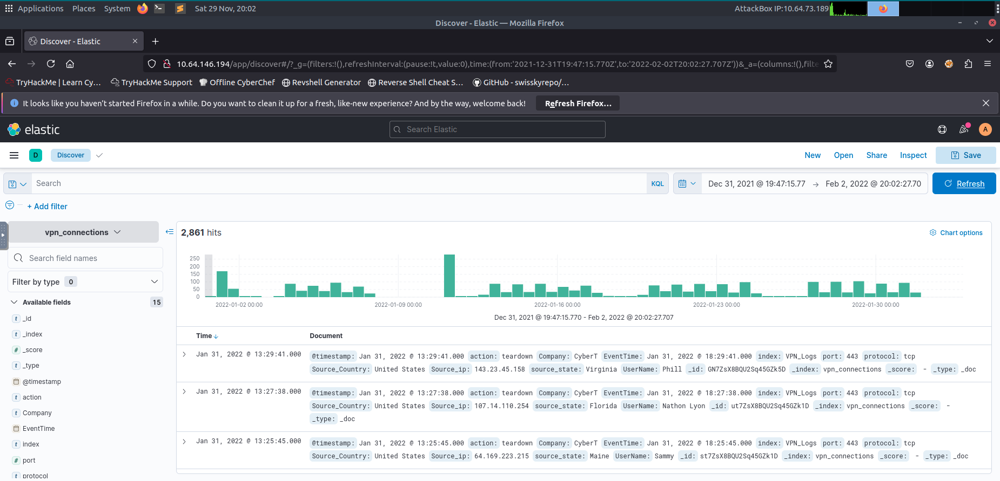

**Response**: 2861

**Question**: Which IP address has the maximum number of connections?

By clicking on "Source_ip" in the tab available fields on the left of the Discover tab we can see the top five ip address of occurence. The first one is 238.163.231.224.

**Response**: 238.163.231.224

**Question**: Which user is responsible for the overall maximum traffic?

We do the same as the previous question this time with the field UserName.

**Response**: James

**Question**: Apply Filter on UserName Emanda; which SourceIP has max hits?

I wrote the following query in the search bar:

```bash
UserName : "Emanda" 
```

In the top 5 "Source_ip" associated with result of this one, the top "Source_ip" is 107.14.1.247.


**Response**: 107.14.1.247

**Question**: On 11th Jan, which IP caused the spike observed in the time chart?

I clicked on the spike in the time chart on 2022-01-11, it lead me to all the connections with 2022-01-11 as value for the field "EventTime". I checked the top 5 maximum occurence of the "Source_ip" field and I obtained the response.

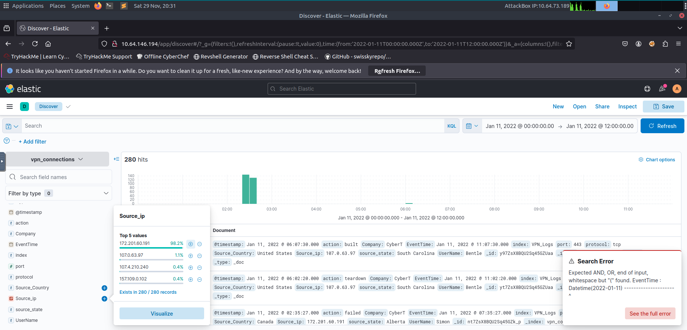

**Response**: 172.201.60.191

**Question**: How many connections were observed from IP 238.163.231.224, excluding the New York state?

I wrote the following query in the search bar:

```bash
Source_ip :  238.163.231.224 AND NOT (source_state:"New York")
```

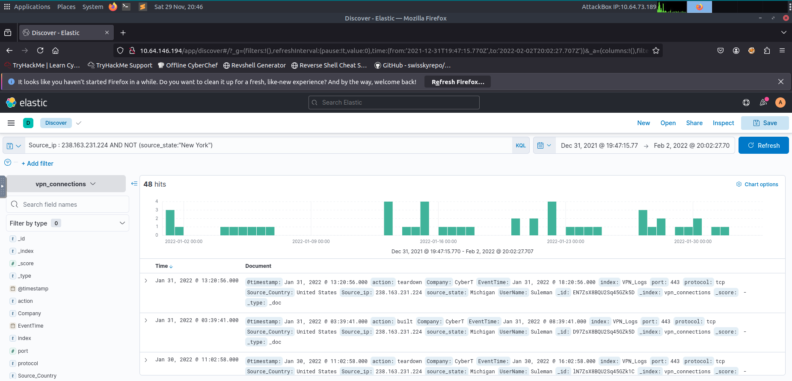

**Response**: 48

**Question**: Create a table with the fields IP, UserName, Source_Country and save.

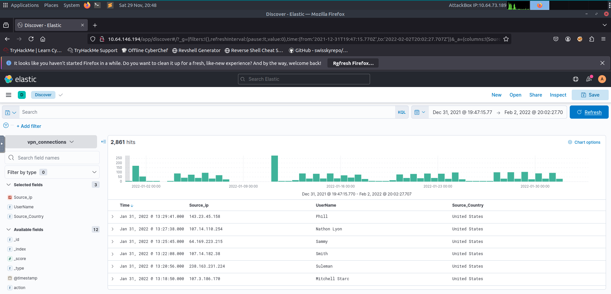

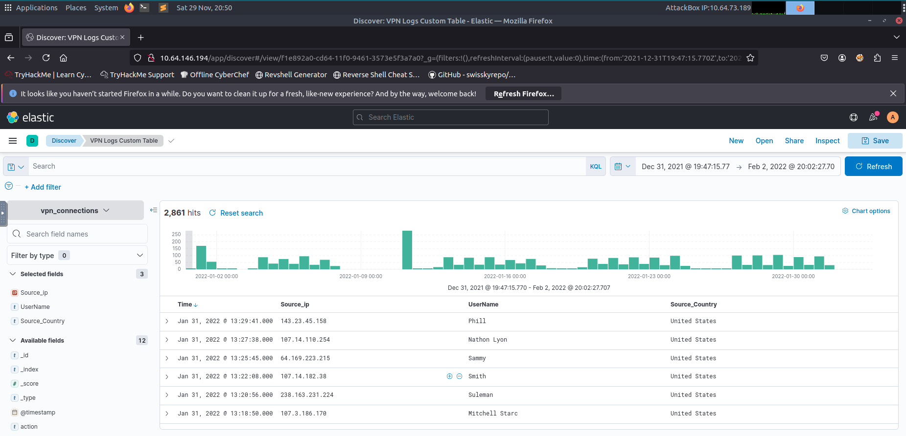


## Task 5: KQL Overview

The Kibana Query Language (KQL) is a simple, text-based query language used within Kibana to filter and search data stored in Elasticsearch. It provides a user-friendly way to interact with your data, focusing specifically on filtering and finding relevant documents.

With KQL, we can search for the logs in two different ways.

- Free text search
- Field-based search

### Free text Search

Free text search allows users to search for logs based on text only. That means a simple search of the term security will return all the documents that contain this term, irrespective of the field. For example, if i search "United States" in the search bar it return 2304 hits with "United States" in any of the field.

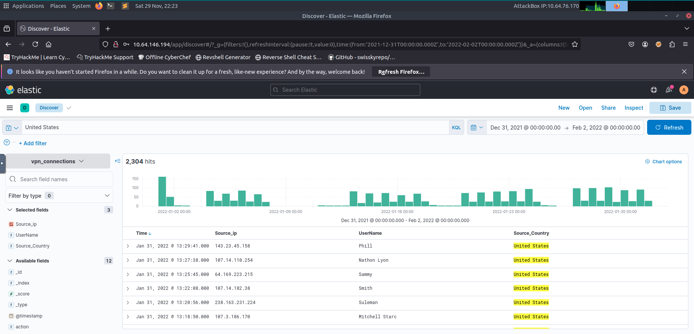


KQL also allows user to use logical operators like AND, OR, NOT.


### Field-based search

In the Field-based search, we will provide the field name and the value we are looking for in the logs. This search has a special syntax as `Field: Value`. It uses a colon as a separator between the field and the value. The following query ask to Kibana to find all logs with "UserName" James and "Source_ip" 151.164.74.14.

```bash
Username : "James" AND "Source_ip" : 151.164.74.14
```

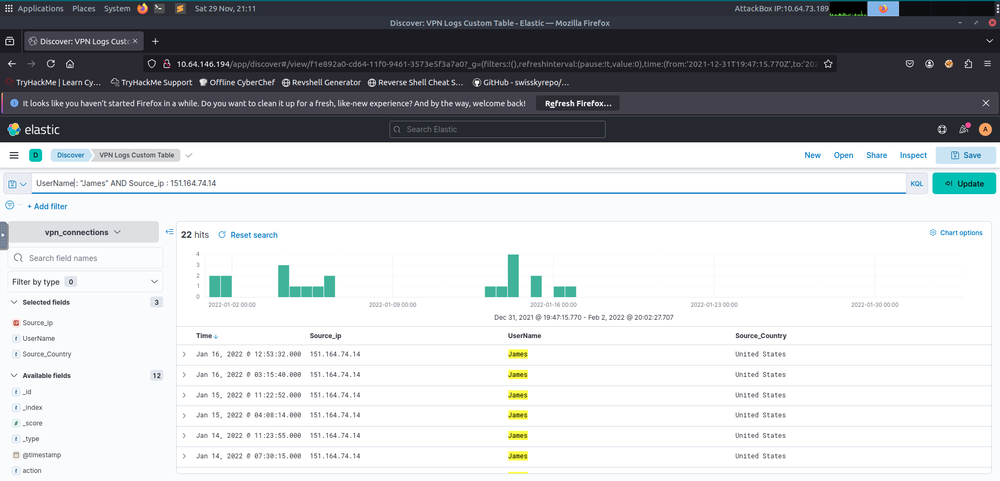

---

Answer the questions below.

**Question**: Create a search query to filter the logs where Source_Country is the United States and show logs from User James or Albert. How many records were returned?

I used the following query:

```bash
Source_Country : "United States"  AND (UserName : "James" OR UserName : "Albert" )
```

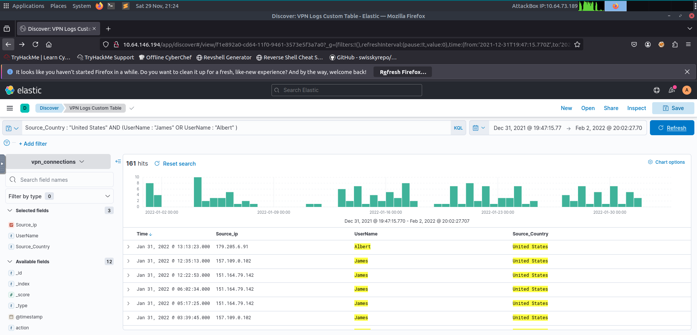

**Response**: 161

**Question**: A user Johny Brown was terminated on the 1st of January, 2022. Create a search query to determine how many times a VPN connection was observed after his termination.

I used the following query:

```bash
UserName : "Johny Brown" AND EventTime > "2022-01-01"
```

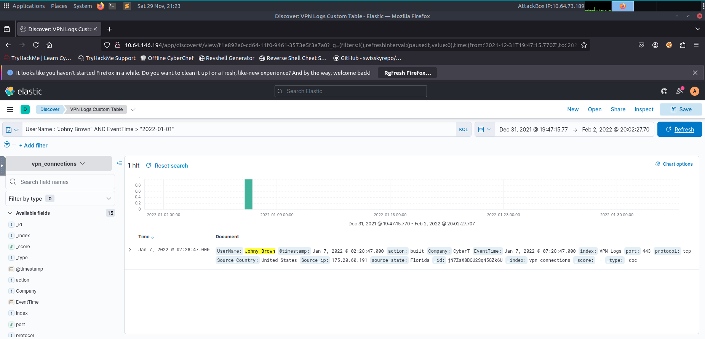

**Response**: 1


## Task 6: Creating Visualizations

In this task, I created a visualization to show the user and the IP address involved in failed attempts. I first created a custom filter that I named "action_failed" to select the connections that have the field "action" with value "failed". I then clicked on the field "Source_ip", clicked on **Visualize** and it redirect me to a visualization page with different type of chart. I chose **table** as chart and added on the right panel the field "UserName". I clicked on each field in the right panel to change their respectively to "IP Address", "UserName" and "Total Connections".

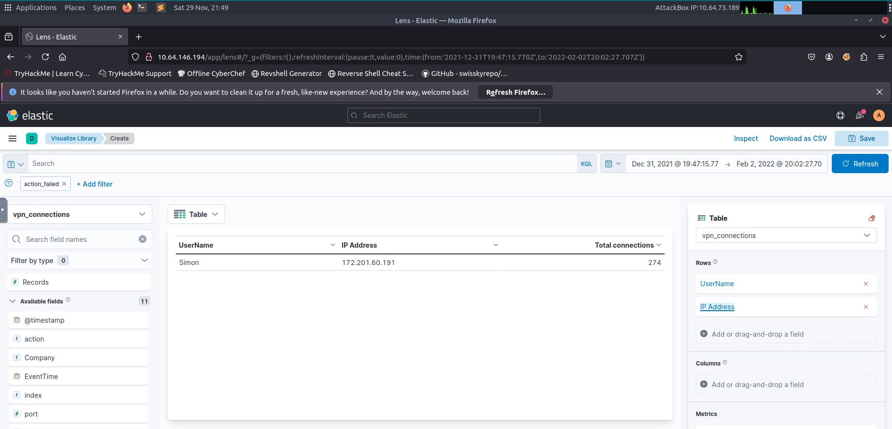

---

Answer the questions below.

**Question**: Which user was observed with the greatest number of failed attempts?

**Response**: Simon

**Question**: How many wrong VPN connection attempts were observed in January?

**Response**: 274


## Creating Dashboards

I went to the control panel on the top left, clicked on **Dashboard** then clicked on **Create dashboard**. in the dashboard I clicked on **Add from library** and selected the table "VPN Logs Custom Tale" that I created in the previous task.

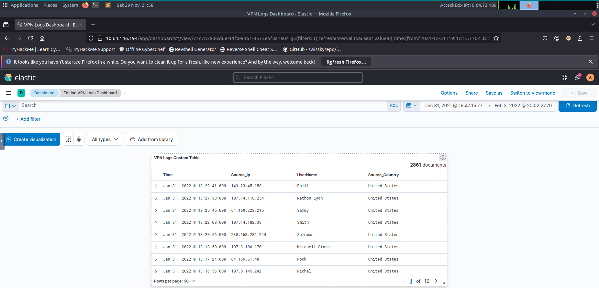


## Conclusion

This room contain the necessary informations to learn the foundations of Elastic Stack. I learned ELK fonctionalities, I had the chance to practice searching, investigating and creating visualizations and dashboards in Elastic Stack. I also learn how to use Kibana Query Langage to create specifics queries for my research.